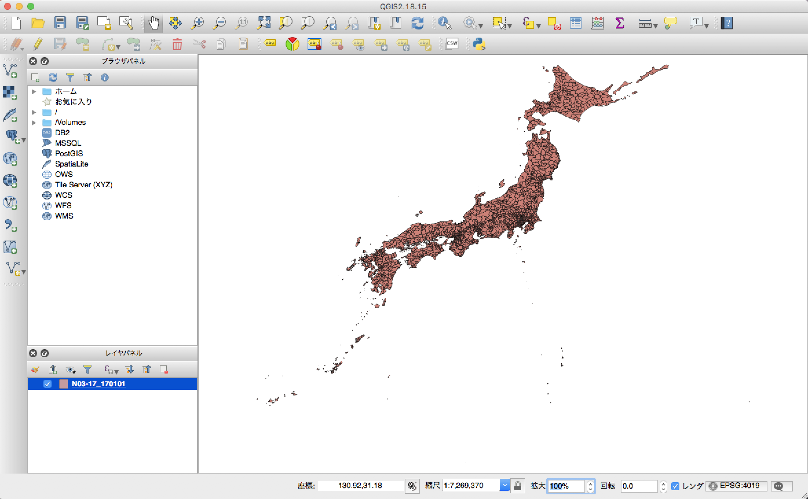

# GIS（地理情報システム）入門
## 地形図データ（シェープファイル）の入手

- [GISホームページ - 国土交通省独土政策局国土情報課 - 国土数値情報 ダウンロードサービス](http://nlftp.mlit.go.jp/ksj/index.html)
 - [国土数値情報 行政区域データ](http://nlftp.mlit.go.jp/ksj/gml/datalist/KsjTmplt-N03-v2_3.html)

ここでは以下のデータをダウンロードします。

|ファイル名|ファイル容量|年度|測地系|地域|
|:---|:---|:---|:---|:---|
|N03-170101_GML.zip|230.00MB|平成29年|世界測地系|全国|

>国土情報利用約款

>第３条　国土数値情報」の適用限界等とその継承・伝達について
（１）「国土数値情報」は、それぞれの原典に忠実に、国土地理院発行の２万５千分１地形図またはその電子成果を基図に座標取得をしたもので、それぞれに起因する空間 的誤差及び時間的誤差を有します。空間的には原典が住所情報である場合、代表点は街区・大字レベル（概ね数100メートル）の公差を持ち、時間的には１～５年程度のライムラグを有します。よって、中間加工者や最終利用者に至るまでの全ての利用者は、各指標の適用限界を理解し、目的に合致するかどうかをそれぞれ必ず自己判断してください。また、誤った利用が生じないよう。適用限界を継承・伝達してください。

### シェープファイルとは
米Esri社の提唱したベクトル形式の業界標準フォーマットです。仕様が公開されており、GIS（地理情報システム）間でのデータ相互運用に用いられています。
実体は単一のファイルではなく、少なくとも以下の3つのファイルが必要です。

#### 主な構成ファイル

|拡張子|概要|
|:---|:---|
|.shp|図形の情報を格納するメインファイル|
|.shx|図形のインデックス情報を格納するファイル|
|.dbf|図形の属性情報を格納するテーブル（dBASE IV形式ファイル）|

参考: [シェープファイルとは？ - GIS基礎解説 - ESRIジャパン](https://www.esrij.com/gis-guide/esri-dataformat/shapefile/)

## シェープファイルの文字コード変換
入手したシェープファイルで使用されている文字コードはShift JISのため、これをUTF-8に変換します。

### QGIS
シェープファイルを扱うことができるデスクトップアプリケーションです。オープンソースソフトウェアで無償で使用することができます。
https://qgis.org



1. ダウンロードしたファイル N03-17_170101.shp をQGISで開きます。
2. 左下の[レイヤパネル]から **N03-17_170101** を選択して右クリックし[プロパティ]を選びます。
3. 表示されたレイヤ情報の[データソースエンコーディング]を **Shift_JIS** に設定します。
4. 再度左下の[レイヤパネル]から **N03-17_170101** を選択して右クリックし[名前をつけて保存する...]を選びます。
5. エンコーディングが **UTF-8** であることを確認して、任意のファイル名で保存します（ここでは japan2017.shp とします）。

## Oracleに取り込む
- [Oracle® Spatial and Graph開発者ガイド 12c リリース1 (12.1)](https://docs.oracle.com/cd/E49329_01/appdev.121/b72470/toc.htm)
 - [D Spatial and GraphへのESRIシェープファイルのロード](https://docs.oracle.com/cd/E49329_01/appdev.121/b72470/sdo_shapefile_converter.htm)

上記のドキュメントを参照してシェープファイルをOracle DBに取り込みます。
ここではCentOS 7.4を使用します。

### Oracleユーザでコマンドを実行する
- シェープファイル名(shapefile_name)には拡張子を除いたファイル名を指定します。
- SRIDはMDSYS.CS_SRSテーブルに6668(JGD2011)がないため、4612(JDG2000)を指定しています。

`
$ java -cp $ORACLE_HOME/jdbc/lib/ojdbc7.jar:$ORACLE_HOME/md/jlib/sdoutl.jar:$ORACLE_HOME/md/jlib/sdoapi.jar oracle.spatial.util.SampleShapefileToJGeomFeature -h db_host -p db_port -sn db_sevicename -u db_username -d db_password -t geo_japan -f shapefile_name -r 4612
`
```
Creating new table...
Converting record #10 of 116024
Converting record #20 of 116024
Converting record #30 of 116024
Converting record #40 of 116024
Converting record #50 of 116024
...
Converting record #116000 of 116024
Converting record #116010 of 116024
Converting record #116020 of 116024
116024 record(s) converted.
Done.
```

### 空間インデックスの作成
`CREATE INDEX IDX_GEO_JAPAN ON GEO_JAPAN (GEOMETRY) INDEXTYPE IS MDSYS.SPATIAL_INDEX;`

### SQLで検索
経度・緯度で指定した点を含むジオメトリを検索します。
SRIDには4326(WGS84)を指定しています。
検索結果の列は次のように定義されています。

|列名|定義|説明|
|:---|:---|:---|
|N03_001|都道府県名|当該区域を含む都道府県名称|
|N03_002|支庁・振興局名|当該都道府県が「北海道」の場合、該当する支庁・振興局の名称|
|N03_003|郡・政令都市名|当該行政区の郡または政令市の名称|
|N03_004|市区町村名|当該行政区の市区町村の名称|
|N03_007|行政区域コード|都道府県コードと市区町村コードからなる、行政区を特定するためのコード|

参考: 列名を変更したり、列を追加・削除したい場合はAccess 2016等を用いて .dbf ファイルを編集してから取り込みます。

#### 東京タワー (経度 139.745556 / 緯度 35.658611)
所在地: 東京都港区芝公園四丁目2番8号
```
SELECT * FROM GEO_JAPAN
WHERE SDO_CONTAINS(GEOMETRY, SDO_GEOMETRY(2001, 4326, SDO_POINT_TYPE(139.745556, 35.658611, NULL), NULL, NULL))='TRUE';
```
|N03_001|N03_002|N03_003|N03_004|N03_007|GEOMETRY|
|:---|:---|:---|:---|:---|:---|
|東京都|(null)|港区|(null)|13103|[MDSYS.SDO_GEOMETRY]|

#### MAZDA Zoom-Zoom スタジアム広島 (経度 132.484667 / 緯度 34.391972)
所在地: 広島県広島市南区南蟹屋2-3-1
```
SELECT * FROM GEO_JAPAN
WHERE SDO_CONTAINS(GEOMETRY, SDO_GEOMETRY(2001, 4326, SDO_POINT_TYPE(132.484667, 34.391972, NULL), NULL, NULL))='TRUE';
```
|N03_001|N03_002|N03_003|N03_004|N03_007|GEOMETRY|
|:---|:---|:---|:---|:---|:---|
|広島県|(null)|広島市|南区|34103|[MDSYS.SDO_GEOMETRY]|

#### 札幌市時計台 (経度 141.353611 / 緯度 43.0625)
所在地: 北海道札幌市中央区北1条西2丁目
```
SELECT * FROM GEO_JAPAN
WHERE SDO_CONTAINS(GEOMETRY, SDO_GEOMETRY(2001, 4326, SDO_POINT_TYPE(141.353611, 43.0625, NULL), NULL, NULL))='TRUE';
```
|N03_001|N03_002|N03_003|N03_004|N03_007|GEOMETRY|
|:---|:---|:---|:---|:---|:---|
|北海道|石狩振興局|札幌市|中央区|01101|[MDSYS.SDO_GEOMETRY]|

## 参考リンク
- [世界測地系移行の概要 - 国土交通省 国土地理院](http://www.gsi.go.jp/LAW/G2000-g2000.htm)
- [空間データで遊ぶ - オラクルエンジニア通信 - SlideShare](https://www.slideshare.net/oracle4engineer/database-spatial-features)
- [シェープファイルの拡張子 - ArcGIS ヘルプ 10.1 ](http://resources.arcgis.com/ja/help/main/10.1/index.html#//005600000003000000)
- [シェープファイルの技術情報 (PDF) - ESRIジャパン株式会社](https://www.esrij.com/cgi-bin/wp/wp-content/uploads/documents/shapefile_j.pdf)
- [空間参照系の概要 - Qiita](https://qiita.com/yellow_73/items/b98d3d1ef3abf7299aba)
- [「測地成果2000」と「測地成果2011」 - 国土交通省 国土地理院](http://www.gsi.go.jp/sokuchikijun/jgd2000-2011.html)
- [日本測地系2011 (JDG2011) とは - 空間情報クラブ](http://club.informatix.co.jp/?p=998)
